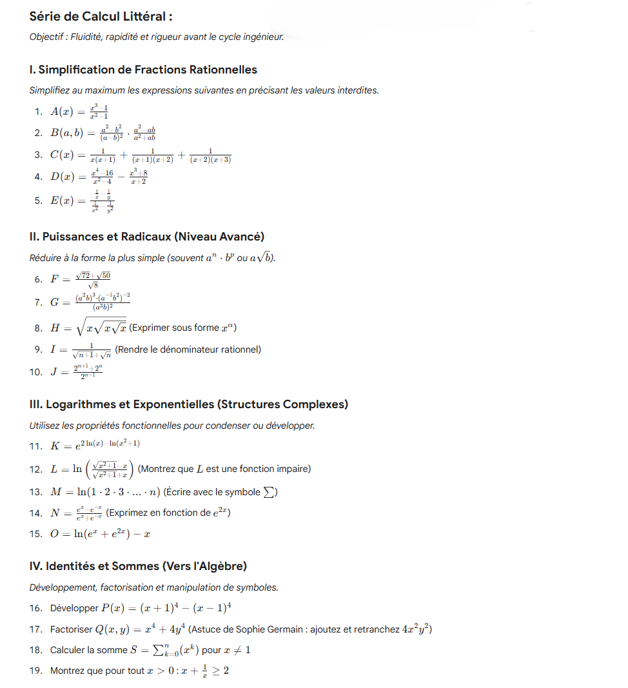
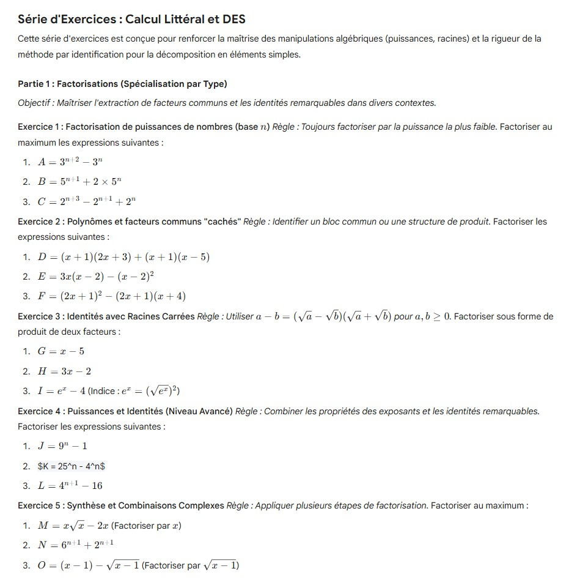

# Calcul Littéral et Décomposition en Eléments Simples (DES)

:octicons-info-16: **Semaine 3**

??? abstract "Enoncé"

    

??? success "Corrigé"
    
    corrige

:octicons-info-16: **Semaine 4**

??? abstract "Enoncé : Partie 1"

    

??? abstract "Enoncé : Partie 2"

    

??? success "Corrigé"
    
    corrige