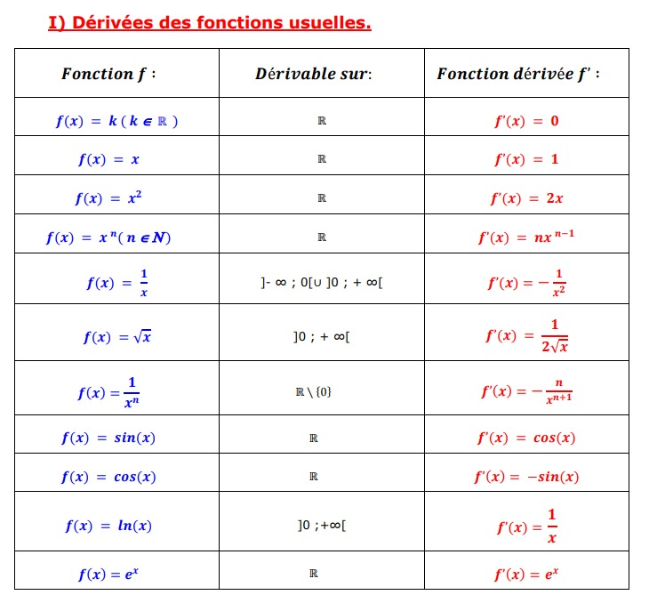
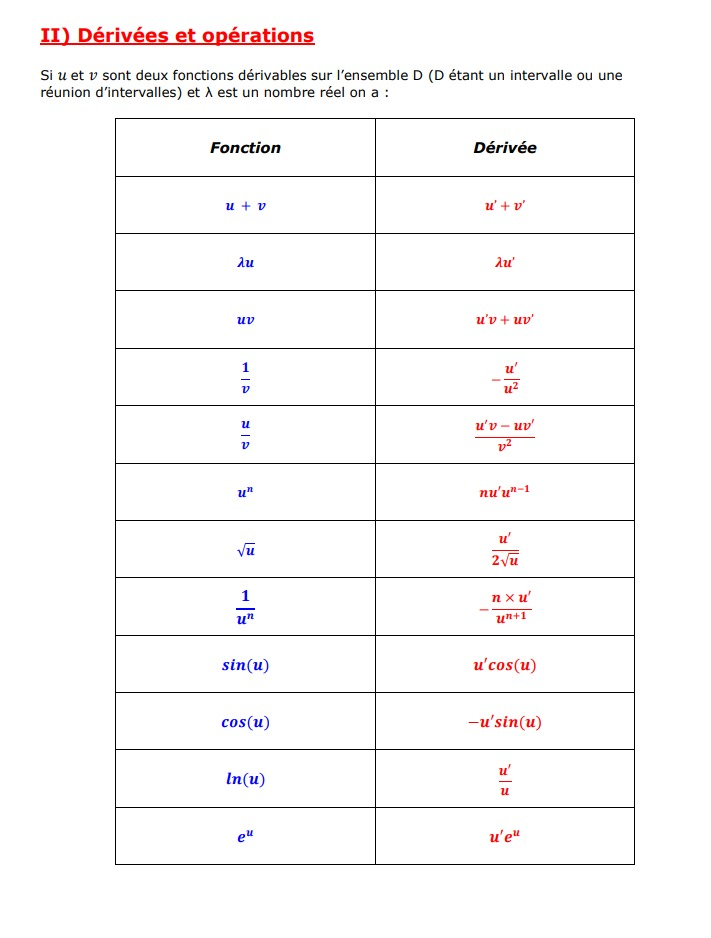

# Derivées des Fonctions Usuelles et Operations

<table style="border-collapse: collapse; width: 100%;">
  <tr>
    <td style="border: 1px solid black; padding: 40px; font-size: 16px; width: 33%;">
      \( f(x) = \tan(x) = \frac{\sin(x)}{\cos(x)} \)
    </td>
    <td style="border: 1px solid black; padding: 40px; font-size: 16px; width: 33%;">
      \( \mathbb{R} \setminus \left\{ \frac{\pi}{2} + k\pi \right\} \)
    </td>
    <td style="border: 1px solid black; padding: 40px; font-size: 16px; width: 33%;">
      \( f'(x) = \frac{1}{\cos^2(x)} \)
    </td>
  </tr>
</table>

<table style="border-collapse: collapse; width: 100%;">
  <tr>
    <td style="border: 1px solid black; padding: 40px; font-size: 16px; width: 33%;">
      \( \tan(u) = \frac{\sin(u)}{\cos(u)} \)
    </td>
    <td style="border: 1px solid black; padding: 40px; font-size: 16px; width: 33%;">
      \( \mathbb{R} \setminus \left\{ \frac{\pi}{2} + k\pi \right\} \)
    </td>
    <td style="border: 1px solid black; padding: 40px; font-size: 16px; width: 33%;">
      \( \frac{u'}{\cos^2(u)} \)
    </td>
  </tr>
</table>
