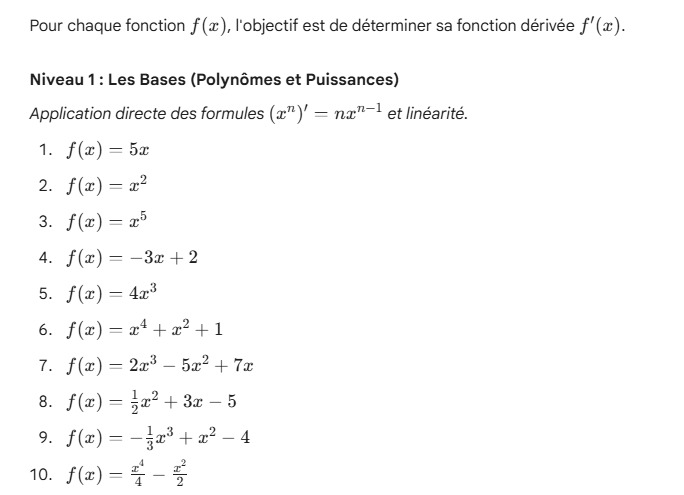
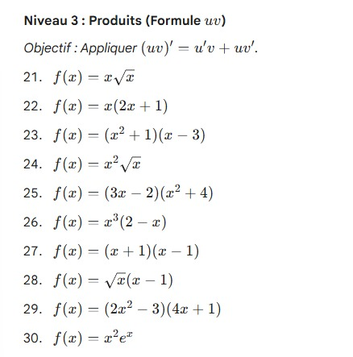
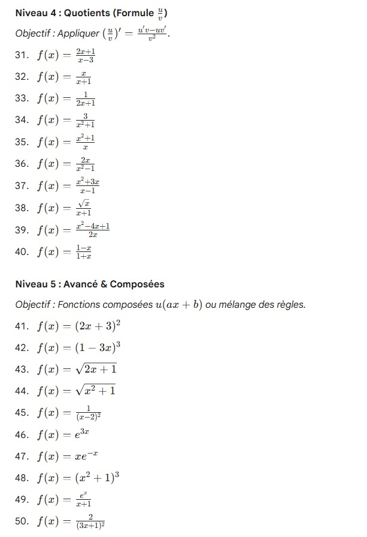
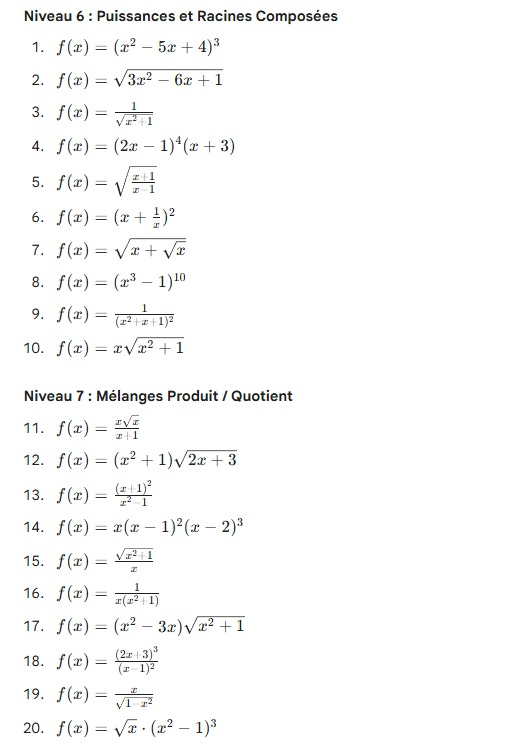
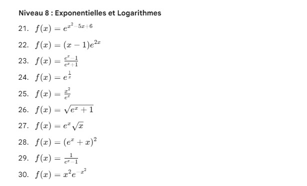
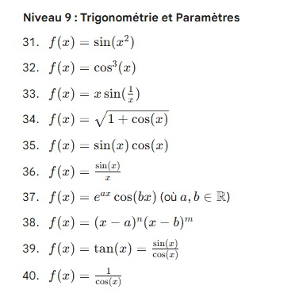
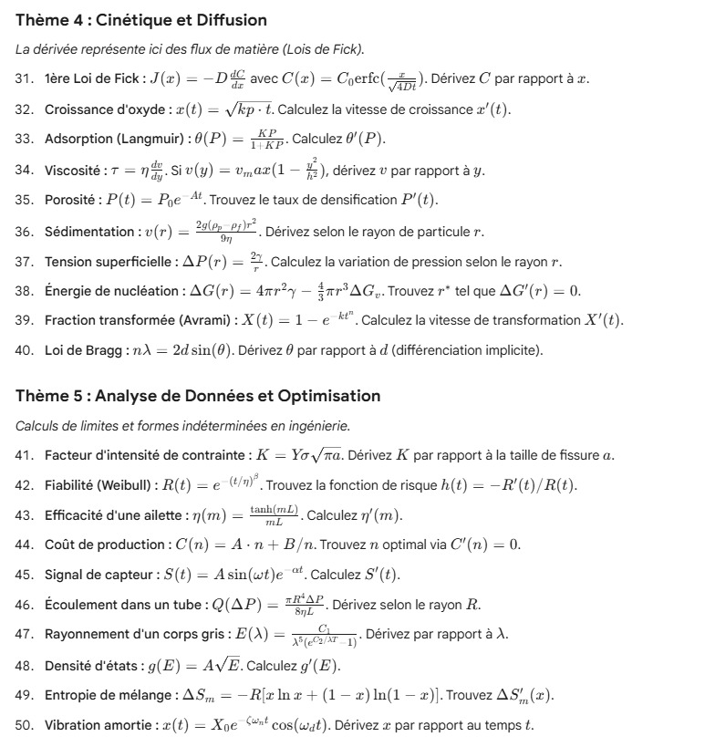

# Derivées des Fonctions Usuelles et Operations

:octicons-info-16: **Semaine 7**

??? abstract "Enoncé: Partie 1"

    

    

    

    

??? abstract "Enoncé: Partie 2"

    

:octicons-info-16: **Semaine 8**

??? abstract "Enoncé: Partie 3"

    

    

    

:octicons-info-16: **Semaine 9**

??? abstract "Enoncé"

    

    

    

??? success "Corrigé"
    
    corrige
    