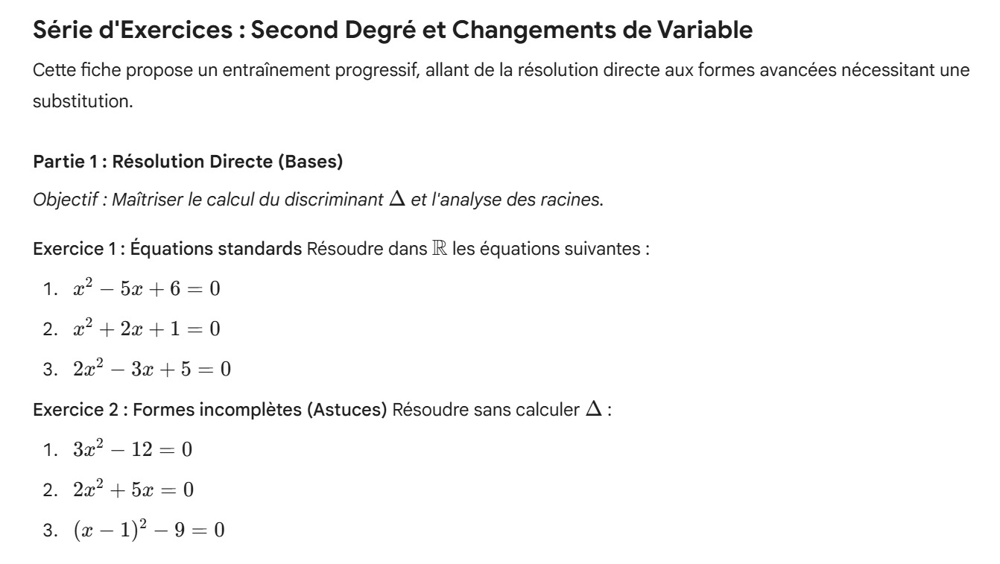
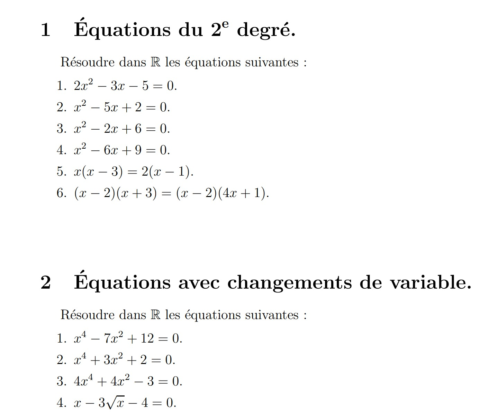

# Second Degré et Changements de Variable

:octicons-info-16: **Semaine 4**

??? abstract "Enoncé : Partie 1"

    

??? abstract "Enoncé : Partie 2"

    

??? abstract "Enoncé : Partie 3"

    

??? abstract "Enoncé : Partie 4"

    

??? success "Corrigé"
    
    corrige

:octicons-info-16: **Semaine 5**

??? abstract "Enoncé"

    

    

    

??? success "Corrigé"
    
    corrige